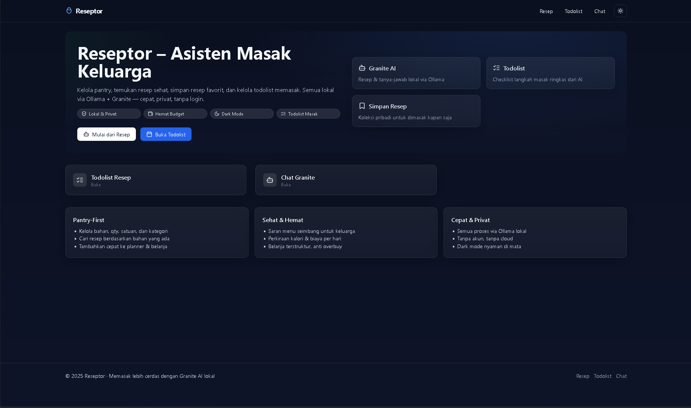

# 🍳 Reseptor - Asisten Masak Keluarga

**Next.js + Ollama AI** untuk asisten kuliner lokal dan privat

🍳 **Kelola pantry, temukan resep sehat, simpan resep favorit, dan kelola todolist memasak.** Semua lokal via Ollama + Granite — cepat, privat, tanpa login.

## 📄 Dokumentasi PDF
- **Panduan Lengkap**: [Reseptor Documentation (PDF)](./Reseptor_Asisten_Masak_Keluarga.pdf)


## 🖼️ Preview Gambar & Video

### 📷 Screenshot Aplikasi

*Contoh tampilan homepage aplikasi Reseptor.*

### 🎥 Video Demo
[](https://www.youtube.com/watch?v=dQw4w9WgXcQ)
*Klik gambar di atas untuk melihat demo aplikasi Reseptor.*

## ✨ Fitur Utama

- 🥘 **Generator Resep AI**: Buat resep otomatis dari bahan pantry dengan Ollama
- 📝 **Todolist Masak**: Checklist langkah masak yang bisa diedit dan disimpan
- 🗂️ **Manajemen Pantry**: Kelola bahan makanan dengan jumlah, satuan, dan kategori
- 💬 **Chat AI Kuliner**: Konsultasi masak & gizi dengan Granite AI lokal
- 🎯 **Model Selector**: Pilih model Ollama sesuai kebutuhan hardware
- 🌙 **Dark/Light Mode**: UI responsif, tema bisa diganti
- 💾 **Simpan Resep Favorit**: Koleksi pribadi resep favorit, tersimpan lokal
- 🔒 **100% Privat**: Semua data di browser, tanpa cloud, tanpa login


## 🚀 Prasyarat

- [Ollama](https://ollama.ai) sudah terinstall & berjalan
- [Node.js](https://nodejs.org) 18+ (untuk development)
- [Docker](https://docker.com) & Docker Compose (untuk deployment)
- Minimal 1 model Ollama terinstall (misal: `granite3.3:8b`, `llama3.2:3b`)


## 📦 Setup & Instalasi

### Opsi 1: Jalankan Lokal (Development)

```bash
# Clone repository
git clone https://github.com/imbasri/reseptor.git
cd reseptor

# Install dependencies
npm install

# (Opsional) Setup environment
echo "OLLAMA_HOST=http://localhost:11434" > .env.local

# Pastikan Ollama sudah running & model sudah di-pull
ollama pull granite3.3:8b

# Jalankan server development
npm run dev
```

Akses aplikasi di: [http://localhost:3000](http://localhost:3000)


### Opsi 2: Jalankan via Docker (Rekomendasi)

**Quick Start (Otomatis download model):**

```powershell
# Windows PowerShell
.\scripts\start.ps1

# Pantau progress download model
docker-compose logs -f ollama-init

# Cek status semua service
.\scripts\status.ps1
```

```bash
# Linux/macOS
./scripts/start.sh

# Pantau progress download model
docker-compose logs -f ollama-init
```

**Manual Docker:**
```bash
# Pull model (opsional)
ollama pull granite3.3:8b

# Jalankan semua service
docker-compose up -d

# Cek status
docker-compose ps
```

**URL setelah setup:**
- 🌐 **Aplikasi**: [http://localhost:3000](http://localhost:3000)
- 🤖 **Ollama API**: [http://localhost:11434](http://localhost:11434)

## ⚙️ Konfigurasi

### Environment Variables (Optional)

`.env.local`:
```bash
# Ollama host (default: http://localhost:11434)
OLLAMA_HOST=http://localhost:11434

# Default model (aplikasi akan auto-detect jika kosong)
# OLLAMA_MODEL=granite3.3:8b
```

### Custom Ollama Host

Jika Ollama berjalan di host/port berbeda:
```bash
# Local development
OLLAMA_HOST=http://192.168.1.100:11434

# Docker environment
OLLAMA_HOST=http://host.docker.internal:11434
```

## 🎯 Manajemen Model

### Model Selection UI

- **Auto-Detection**: Aplikasi otomatis mendeteksi model Ollama yang tersedia
- **Manual Selection**: Gunakan Model Selector di navbar untuk memilih model
- **Persistent Choice**: Pilihan tersimpan di localStorage browser
- **Real-time Switch**: Ganti model kapan saja tanpa restart aplikasi

### Prioritas Model (Auto-Selection)

1. **Vision Models**: `llava:*`, `llama3.2-vision:*` (untuk fitur deteksi makanan)
2. **Granite Series**: `granite3.3:*`, `granite3.1:*` (optimal untuk resep)
3. **Llama Series**: `llama3.2:*`, `llama3.1:*` (general purpose)
4. **Lainnya**: Model compatible lainnya

### Cara Menggunakan Model Selector

1. Buka aplikasi dan klik icon **Settings** di navbar
2. Pilih model dari daftar yang tersedia
3. Klik **Refresh Models** untuk update daftar model terbaru
4. Model terpilih otomatis tersimpan dan digunakan untuk semua fitur AI

### Install Model Tambahan

```powershell
# Windows - Interactive installer
.\scripts\install-models.ps1

# Manual install via Docker
docker exec reseptor-ollama ollama pull llama3.2:3b
```

```bash
# Linux/macOS - Interactive installer
./scripts/install-models.sh

# Manual install
ollama pull llama3.2:3b
```

**Model Recommendations:**
- `granite3.3:8b` (4.9GB) - Default, optimal untuk resep
- `llama3.2:3b` (3GB) - Fast, good untuk chat
- `llama3.2:1b` (1GB) - Very fast, basic
- `llama3.2-vision:11b` (7GB) - Image analysis (future feature)

## 🏗️ Struktur Aplikasi

```
📁 Reseptor Project
├── app/
│   ├── page.js              # Homepage dengan overview fitur
│   ├── recipes/             # Generator resep dari pantry
│   ├── todolist/            # Todolist masak dengan checklist
│   ├── chat/                # Chat kuliner dengan Granite AI
│   ├── detect/              # Deteksi makanan (future feature)
│   └── api/
│       ├── models/          # API daftar model Ollama
│       ├── recipes/         # API generate resep
│       ├── chat/            # API chat kuliner
│       ├── mealplan/        # API meal planning
│       └── vision/          # API vision processing
├── components/
│   ├── model-settings.js    # UI selector model Ollama
│   ├── navbar.js            # Navigation dengan model settings
│   └── ui/                  # Komponen UI base (Button, Card, dll)
├── lib/
│   ├── ollama.js            # Integrasi Ollama core
│   └── ai.js                # Utilities AI
└── docker-compose.yml       # Multi-service deployment
```

## � Docker Deployment

### Quick Start dengan Auto-Model Download

```powershell
# Windows - Download granite3.3:8b otomatis
.\scripts\start.ps1

# Monitor download progress
docker-compose logs -f ollama-init

# Check status semua service
.\scripts\status.ps1
```

```bash
# Linux/macOS - Download granite3.3:8b otomatis  
./scripts/start.sh

# Monitor download progress
docker-compose logs -f ollama-init
```

### Monitor Model Download

```bash
# Check download progress (5-15 menit)
docker-compose logs -f ollama-init

# Verify model available
docker exec reseptor-ollama ollama list

# Check all services
docker-compose ps
```

**Download time**: ~5-15 menit tergantung internet (granite3.3:8b ~4.9GB)

### Docker Services

- **reseptor**: Next.js app (port 3000)
- **ollama**: Ollama server (port 11434)  
- **ollama-init**: Auto-download granite3.3:8b (one-time)

### Useful Docker Commands

```bash
# Start services
docker-compose up -d

# Stop services
docker-compose down

# Reset everything (hapus models)
docker-compose down -v

# Rebuild application
docker-compose build reseptor

# View logs
docker-compose logs -f [service-name]

# Check resource usage
docker stats
```

### Install Additional Models

```powershell
# Windows - Interactive installer
.\scripts\install-models.ps1
```

```bash
# Linux/macOS - Interactive installer  
./scripts/install-models.sh

# Manual via Docker
docker exec reseptor-ollama ollama pull llama3.2:3b
```

## 🛠️ API Endpoints

### Core APIs

- `GET /api/models` - List model Ollama yang tersedia
- `POST /api/chat` - Chat kuliner dengan AI
- `POST /api/recipes` - Generate resep dari bahan pantry
- `POST /api/recipes/stream` - Streaming recipe generation
- `POST /api/mealplan` - Meal planning suggestions
- `POST /api/vision` - Image analysis (future)

### Request Headers

```javascript
// Set preferred model via header
fetch('/api/recipes', {
  method: 'POST',
  headers: {
    'Content-Type': 'application/json',
    'x-preferred-model': 'granite3.3:8b'  // Optional
  },
  body: JSON.stringify({ ingredients: ['ayam', 'bawang'] })
})
```

# Check application status
docker-compose ps
```

**Download time**: 5-15 menit (granite3.3:8b ~4.9GB)

### Docker Services

- **reseptor**: Next.js application (port 3000)
- **ollama**: Ollama AI server (port 11434)  
- **ollama-init**: Auto-download granite3.3:8b model

## ⚡ Development

### Local Commands

```bash
npm run dev          # Start development server
npm run build        # Build for production  
npm run start        # Start production server
npm run lint         # Lint check (currently skipped)
```

### Testing Multiple Models

```bash
# Install berbagai model untuk testing
ollama pull granite3.3:8b
ollama pull llama3.2:3b
ollama pull codestral:latest

# Test model selector di aplikasi
npm run dev
# Buka http://localhost:3000, klik Settings, test switch model
```

### Development Features

- **Hot Reload**: Perubahan code langsung reflect di browser
- **Model Switching**: Ganti model real-time via UI tanpa restart
- **Error Handling**: Connection issues ditangani dengan graceful fallback
- **Responsive UI**: Mobile-first design dengan Tailwind CSS
- **Dark Mode**: Theme switching dengan next-themes

## 🎨 UI/UX Features

### Design System
- **Components**: Custom UI components dengan Radix primitives
- **Icons**: Lucide React icon set yang konsisten
- **Styling**: Tailwind CSS dengan custom design tokens
- **Theme**: Dark/Light mode dengan system preference detection
- **Layout**: Responsive grid system untuk mobile & desktop

### User Experience
- **No Login Required**: Langsung gunakan tanpa registrasi
- **Offline First**: Semua data tersimpan di localStorage
- **Fast Loading**: Next.js optimization dengan static generation
- **Progressive Enhancement**: Bekerja dengan dan tanpa JavaScript

## 🐛 Troubleshooting

### Ollama Connection Issues

```bash
# Check Ollama status
ollama list
curl http://localhost:11434/api/tags

# Restart Ollama service
ollama serve

# Test connection
curl -X POST http://localhost:11434/api/generate \
  -d '{"model":"granite3.3:8b","prompt":"hello","stream":false}'
```

### Docker Issues

```bash
# Reset all containers
docker-compose down -v
docker-compose up -d

# Check service logs
docker-compose logs reseptor
docker-compose logs ollama
docker-compose logs ollama-init

# Verify model installation
docker exec reseptor-ollama ollama list

# Check resource usage
docker stats
```

### Model Issues

**Model tidak tersedia**
- Verify model pulled: `ollama list`
- Check spelling model name
- Use Model Selector untuk pilih model lain
- Pull model manual: `ollama pull <model-name>`

**Model lambat/error**
- Check hardware requirements (RAM minimal 8GB untuk model 3B)
- Monitor resource usage: `docker stats`
- Try model yang lebih kecil: `llama3.2:1b`

### Build Issues

```bash
# Check build errors
npm run build

# Clear Next.js cache
rm -rf .next
npm run build

# Check dependencies
npm install
npm audit fix
```

### Performance Tips

- **Hardware**: Gunakan model sesuai RAM (3B=8GB, 8B=16GB+)
- **Concurrency**: Set `OLLAMA_NUM_PARALLEL` untuk multiple requests
- **Storage**: Pastikan cukup disk space untuk model download
- **Network**: Untuk Docker, pastikan port 11434 tidak terblokir

### Common Error Messages

**"Failed to fetch models"**
- Check Ollama service running: `ollama serve`
- Verify host configuration: `OLLAMA_HOST=http://localhost:11434`
- Test API manually: `curl http://localhost:11434/api/tags`

**"Model not found"**
- List available models: `ollama list`
- Pull missing model: `ollama pull granite3.3:8b`
- Use Model Selector to pick available model

**"Port 3000 already in use"**
- Find process: `netstat -ano | findstr :3000`
- Kill process or use different port: `PORT=3001 npm run dev`


## 📱 Fitur per Halaman

### 🏠 Homepage (`/`)
- Ringkasan aplikasi, quick links ke fitur utama, dan highlight value proposition.

### 🥘 Recipes (`/recipes`)
- Input bahan pantry, generate resep AI, simpan ke favorit, export/share resep.

### 📝 Todolist (`/todolist`)
- Checklist langkah masak interaktif, edit langkah, progress tracking per resep.

### 💬 Chat (`/chat`)
- Chat dengan Granite AI, konsultasi masak/gizi, streaming response, context-aware.

### 🔧 Model Settings
- Pilih/switch model Ollama real-time, refresh list model, rekomendasi model.

### 🔍 Detect (`/detect`)
- (Coming soon) Upload foto makanan, analisis nutrisi & saran resep AI.

### Docker Issues

```bash
# Reset all containers
docker-compose down -v
docker-compose up -d

# Check service logs
docker-compose logs reseptor
docker-compose logs ollama
docker-compose logs ollama-init

# Verify model installation
docker exec -it kokita_ollama ollama list
```

### Model Issues

**Model tidak tersedia**
- Verify model pulled: `ollama list`
- Check spelling model name
- Use Model Selector untuk pilih model lain
- Pull model manual: `ollama pull <model-name>`

**Model lambat/error**
- Check hardware requirements (RAM minimal 8GB untuk model 3B)
- Monitor resource usage: `docker stats`
- Try model yang lebih kecil: `llama3.2:1b`

### Performance Tips

- **Hardware**: Gunakan model sesuai RAM (3B=8GB, 8B=16GB+)
- **Concurrency**: Set `OLLAMA_NUM_PARALLEL` untuk multiple requests
- **Storage**: Pastikan cukup disk space untuk model download
- **Network**: Untuk Docker, pastikan port 11434 tidak terblokir

## 📝 Kontribusi

### Cara Berkontribusi
1. Fork repo: `https://github.com/imbasri/reseptor`
2. Buat branch fitur: `git checkout -b feature/nama-fitur`
3. Ikuti gaya penulisan & struktur kode yang ada
4. Test dengan beberapa model Ollama
5. Update dokumentasi jika ada perubahan API/fitur
6. Pull Request dengan deskripsi jelas

### Panduan Kode
- **JavaScript**: ES6+, async/await
- **React**: Functional + hooks
- **Styling**: Tailwind CSS, minim custom CSS
- **API**: RESTful, error handling baik
- **Testing**: Manual dengan berbagai model

### Area Kontribusi
- 🎨 UI/UX
- 🤖 Integrasi AI/model
- 🐳 DevOps/Docker
- 📖 Dokumentasi
- 🧪 Testing
- 🌐 Internationalization

## 📄 License

MIT License - lihat file `LICENSE` untuk detail lengkap.

## 🙏 Acknowledgments

- **[Ollama](https://ollama.ai)** - Local AI model runtime yang powerful
- **[IBM Granite](https://github.com/ibm-granite)** - Foundation model untuk kuliner
- **[Next.js](https://nextjs.org)** - React framework dengan excellent DX
- **[Tailwind CSS](https://tailwindcss.com)** - Utility-first CSS framework
- **[Radix UI](https://radix-ui.com)** - Accessible primitive components
- **[Lucide Icons](https://lucide.dev)** - Beautiful & consistent icon set

## 🔗 Links

- **Repository**: [https://github.com/imbasri/reseptor](https://github.com/imbasri/reseptor)
- **Docker Guide**: [DOCKER.md](./DOCKER.md)
- **Demo**: `http://localhost:3000` (after setup)
- **Ollama**: [https://ollama.ai](https://ollama.ai)

---

**Made with ❤️ for Indonesian home cooks**

*Reseptor membantu keluarga Indonesia memasak dengan lebih cerdas menggunakan AI lokal yang privat dan aman.*
